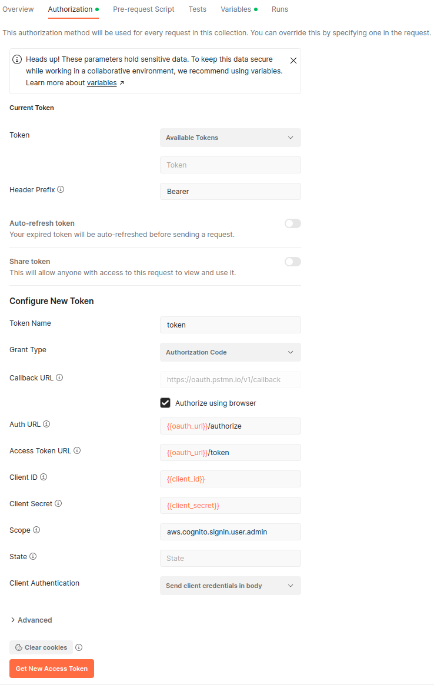
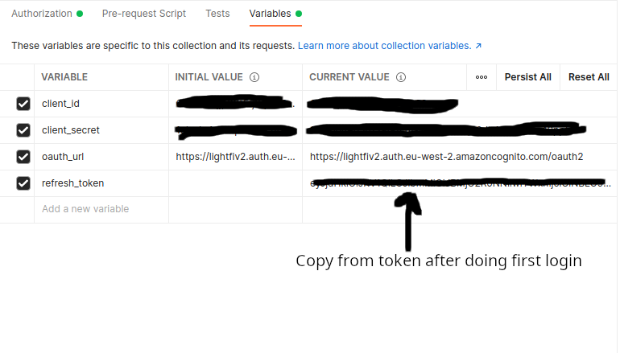
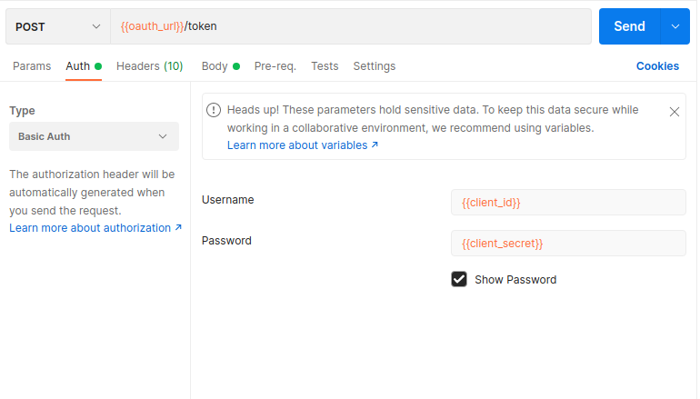
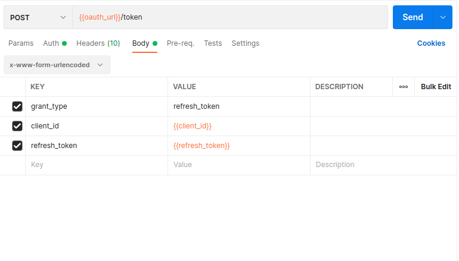

# Obtaining OAuth2 refresh_token
A refresh token can allow programmatic access to the API for the lifetime of the token (up to 10 years, depending on the client configuration). The `refresh_token` is used to obtain an `access_token` (via the `oauth_url`). The `access_token` can then be used with the LightFi API.

Obtaining a refresh token requires the user to login with a web-browser at the secure URL, a callback URL is then used to complete the login process and obtain the tokens. You should consider what is the best login process for your application, below are two examples of how to obtain a refresh token this using [Postman](https://www.postman.com/) and python/flask.

## Using Postman to obtain an OAuth2 refresh token
To obtain a refresh token in Postman (the Postman OAuth login callback URL is allowed in default client settings, but can be disabled on request) use the following configuration.

### Obtaining a refresh token
#### OAuth Setup

Configure the Authorization in Postman in the following way:



#### OAuth Variables

You should define the variables used in the OAuth config according to the client details you have been sent by LightFi.



### Using the refresh token
Use the `oauth_url` to obtain an `access_token` using your `refresh_token`, this can then be used to make calls to the API.
You do not need to do this in Postman (a python example can be found [here](client_example.md#using-a-refresh-token)), but the following images show how to use Postman to obtain a new `access_token`





## Using Python/Flask to obtain an OAuth2 refresh token

- Make sure you have python and [flask](https://flask.palletsprojects.com/en/2.3.x/installation/) installed, either globally or in a python virtual environment.
  - e.g. To install in a python virtual environment using pip
  ```sh
  python -m venv venv  # Create virtual environment
  source venv/bin/activate
  pip install flask requests
  ```
- The default script (below) obtains `CLIENT_ID` and `CLIENT_SECRET` from environment variables, so set these in your environment.
```sh
export CLIENT_ID=YOUR_CLIENT_ID
export CLIENT_SECRET=YOUR_CLIENT_SECRET
```
- Save the script (below) e.g. as `oauth_obtain_refresh_token.py`
- Run the script and navigate to http://localhost:3000 in web browser to begin the login process (the URL can be changed but make sure that the URL you use is registered as a `callback_url` for your API client).
```sh
python oauth_obtain_refresh_token.py
```

```python
import json
import os

import requests
from flask import Flask, redirect, request

app = Flask(__name__)

# Client details in environment variables (or edit the lines for your client)
CLIENT_ID = os.environ["CLIENT_ID"]
CLIENT_SECRET = os.environ["CLIENT_SECRET"]

# Default details
REDIRECT_URI = "http://localhost:3000"  # Must be registered as a callback_url for your client
OAUTH_URL = "https://lightfiv2.auth.eu-west-2.amazoncognito.com/oauth2"
AUTH_URL = f"{OAUTH_URL}/authorize"
TOKEN_URL = f"{OAUTH_URL}/token"
SCOPE = "aws.cognito.signin.user.admin"


@app.route("/")
def home():
    code = request.args.get("code")
    if code:
        # User is redirected back to your app with authorization code
        # Get the access and refresh tokens
        payload = {
            "grant_type": "authorization_code",
            "code": code,
            "redirect_uri": REDIRECT_URI,
            "client_id": CLIENT_ID,
            "client_secret": CLIENT_SECRET,
        }
        response = requests.post(TOKEN_URL, data=payload)
        tokens = json.loads(response.text)

        # Print the tokens
        return f"Access Token:<br/>{tokens.get('access_token')}<br/><br/>Refresh Token:<br/>{tokens.get('refresh_token')}"
    else:
        # Redirect user to service's authentication page
        return redirect(
            f"{AUTH_URL}?response_type=code&client_id={CLIENT_ID}&scope={SCOPE}&redirect_uri={REDIRECT_URI}"
        )


if __name__ == "__main__":
    app.run(debug=True, port=3000)
    # Open http://localhost:3000 in your browser to obtain tokens
```
