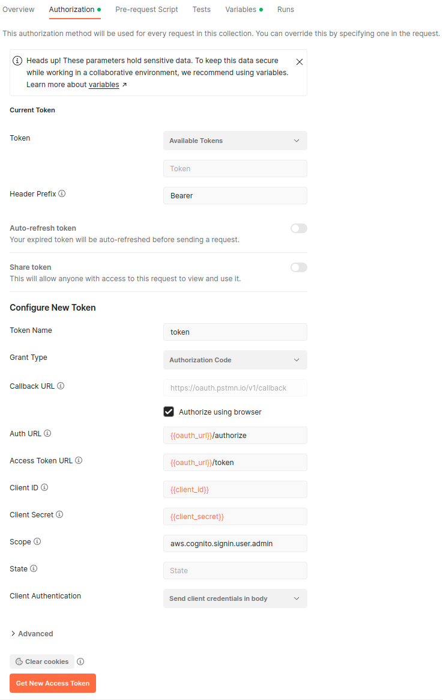

# Using Postman to obtain an OAuth refresh token

A refresh token can allow programmatic access to the API for the lifetime of the token (up to 10 years, depending on the client configuration), via using the `refresh_token` to obtain an `access_token` (using the `oauth_url`) which can then be used with the API.

To obtain a refresh token in Postman (the Postman OAuth login callback URL is allowed in default client settings, but can be disabled on request) use the following configuration.

### Obtaining a refresh token
#### OAuth Setup

Configure the Authorization in Postman in the following way:

#### OAuth Variables

You should define the variables used in the OAuth config according to the client details you have been sent by LightFi.

### Using the refresh token
Use the `oauth_url` to obtain an `access_token` using your `refresh_token`, this can then be used to make calls to the API.
You do not need to do this in Postman, but the following images show how to use Postman to obtain a new `access_token`

