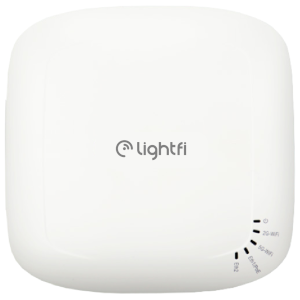
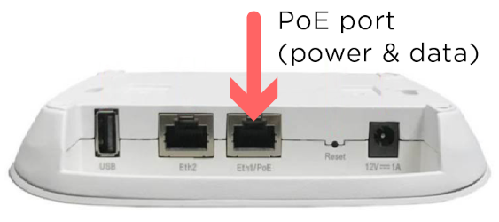
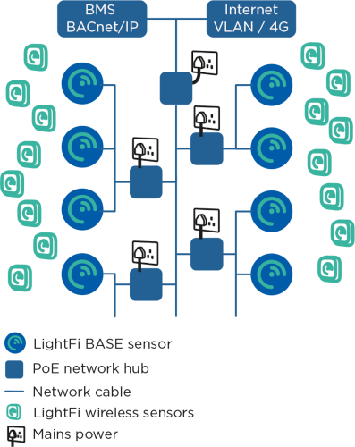
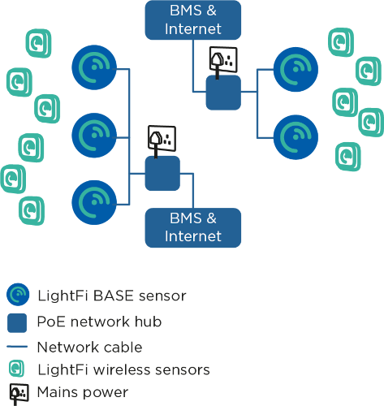
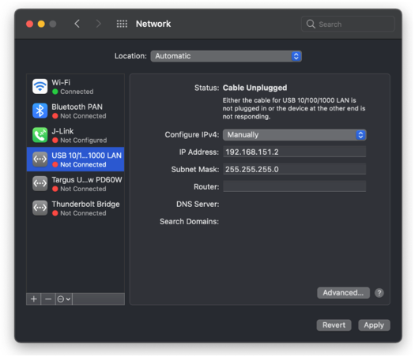
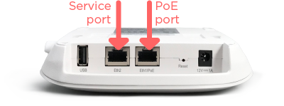
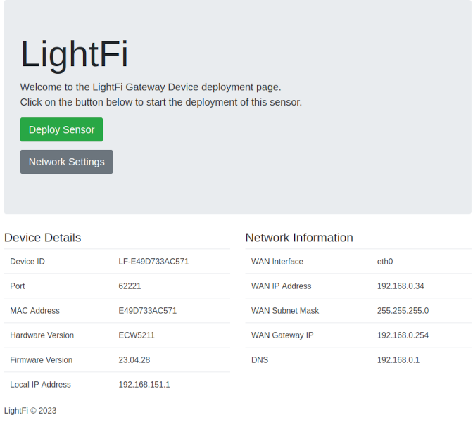
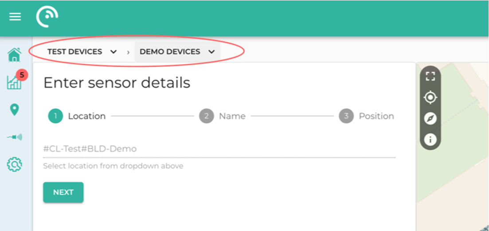
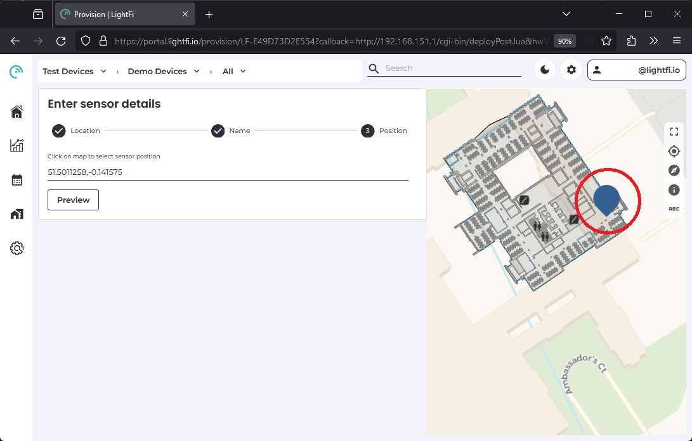

# Installation

## Installing the BASE sensor (ethernet)
### Overview
#### General
<!-- {: style="height:300px;width:300px"} -->

The BASE is a long-range, occupancy level sensor that
makes up the core of LightFi’s multi-sensor wireless IoT
infrastructure. It acts as a gateway and can support 100s to
1000s of LightFi’s IoT sensors. The BASE Pro version
includes BACnet/IP integration with all connected IoT
sensors for building automation capabilities.
This documentation describes how to install the BASE sensor and
provision it on LightFi’s Portal online.

#### What is included

The BASE sensor comes with a power supply and a mounting bracket.
Some models may also come with a USB dongle, which receives data from LightFi's other IoT
sensors. Please ensure the USB dongle is plugged into the BASE’s USB port before
installation. (On most models this functionality is built into the BASE unit.)

#### Placement
The BASE sensors is designed to be ceiling mounted. We recommend that each BASE
sensor cover a 10m – 15m radius (100-250m²) of the floor plan when determining install locations. For open-plan areas, a coverage radius of 20m may be acceptable. For sites with many walls a
coverage radius of < 10m may be necessary. A typical install location is near existing WiFi
Access Points.

#### Power
The BASE sensor can be powered via DC power input or Power over Ethernet (PoE) 802.3af
(48V) via the POE Port. In almost all instances, we recommend using PoE, as this will
provide data and power over a single cable. Where PoE is not available the device can be powered using the DC power input port.

CAUTION: DO NOT POWER DEVICE USING DC CONNECTION AND PoE AT THE SAME TIME, AS THIS
MAY RESULT IN DAMAGE TO THE DEVICE AND RENDER THE WARRANTY NULL AND VOID.

### Cabling topology for the BASE sensors
The cabling topology for the BASE sensors will depend on available network ports
throughout the building. The BASE sensors are powered with Power over Ethernet (PoE)
802.3af, such that power and data can be handled with a single Ethernet cable.

<figure markdown>
  
  <figcaption>Example 1</figcaption>
</figure>
  <!-- {: style="height:300px;width:300px"} -->
<figure markdown>
  
  <figcaption>Example 2</figcaption>
</figure>

#### Using existing network ports
The simplest install is to utilise any available spare network ports across the building. The
BASE sensors can be plugged into existing ports (with PoE) and connected via a VLAN, or a
physically separate network at the comms room. If no network ports are available, new cables
need to be run.

#### Running new cables
The BASE sensors can be ceiling mounted (similar to WiFi Access Points). CAT5E, CAT6 or better
network cables need to be run from the BASE sensors to a nearby network connection point,
such as a BMS panel or comms room. The network cables will provide power to the BASE
sensors, as well as a connection to the internet and BACnet/IP communication with the BMS
(where relevant).
The cabling topology will depend on the location of available connection ports. Two topology
examples are provided below. In the first example a building has a single BMS panel in the
plant room and an internet connection in the comms room. In the second example, there is a
BMS panel on each floor with an internet connection.

### Provisioning the BASE sensor
To provision the BASE sensor on LightFi’s Portal, you will need to following:
- Base sensor powered and connected to the internet
- Ethernet cable
- Physical access to the BASE sensor
- Laptop computer with an Ethernet port and WiFi connection

##### 1 - Boot sensor
Please ensure the BASE sensor is powered and connected to the internet. The LEDs
indicate the status of the BASE sensor:

- First LED on – the BASE sensor has power
- Second LED on – the BASE sensor is connected to the internet
- Third LED on – the BASE sensor is detecting occupancy.
Once plugged in, please allow 5 minutes for the boot sequence to finish before any
troubleshooting.

CAUTION: DO NOT POWER DEVICE USING DC CONNECTION AND PoE AT THE SAME TIME, AS THIS
MAY RESULT IN DAMAGE TO THE DEVICE AND RENDER THE WARRANTY NULL AND VOID.

##### 2 - Setup service port connection
(Before you make the changes to your network configuration, note your default LAN settings
before changing them, this will help when resetting them back when finished.)

Please ensure your computer is connected to the internet e.g. via WiFi.
Setup your computer’s wired (Ethernet) network settings to enable connection to the BASE
sensor via its Service Port. Change the LAN configuration settings on your computer to
“manual” and use the static IP Address: 192.168.151.2 and press Apply. (Use a default Subnet
Mask of 255.255.255.0 and leave the other settings empty, as there is no internet connection
from the BASE sensor via the Service Port for security reasons). Your LAN settings are
located in:

- Apple: System Preferences > Network > {your LAN Service} > Configure IPv4 :
Manually
- Windows: Windows Settings > Network & Internet > Advanced network settings :
Change adapter options > Ethernet : Properties > Internet Protocol Version 4
(TCP/IPv4) : Properties > Use the following IP address

#### 3 - Connect to sensor

Connect an Ethernet cable from your computer to the Service Port on the BASE sensor.
Please ensure the POE Port is also connected to the internet.

#### 4 - Launch Provisioner
Please open your web browser (e.g. Google Chrome) and enter http://192.168.151.1 into the
address bar. You will be greeted by the BASE sensor’s service page, indicating that you are
now connected to the BASE sensor, to the internet and the BASE sensor is itself connected
to the internet. 

If the BASE sensor greeting page says “No Internet!”, please check the BASE
sensor’s POE Port is connected to the internet and refresh the web-page.
You may need to change the device network settings for your network/internet setup,
if so click the "Network Settings" button, you will require the local config password
shipped with your device (the password can be changed from the Network Settings page).

To begin provisioning your BASE sensor on LightFi’s Portal, press “Deploy Sensor”. Please
ensure your computer is connected to the internet e.g. via WiFi. You will be redirected to the
LightFi Portal, where you can login to your LightFi account and create the sensor.

#### 5 Select location
In the top left corner, select the building and floor where you want to create this BASE sensor
using the dropdown. Then press “Next”.

#### 6 Add sensor details
Give the BASE sensor a name (usually the name of the area it covers), and press “Next”. Click
on the floorplan to give the sensor a position (as close to where it is or to be located so that
others can find it later), and then press “Preview”.

#### 7 - Check details
Check you’re happy with the details you’ve entered and the location tree in which you’re
creating the sensor.

#### 8 - Confirm
Press “Confirm Details” and then “Create” to provision the sensor. Your browser may ask for
security confirmation, in which case you will need to allow the connection by pressing “Send
Anyway” (or similar).

#### 9 - Provisioning
The BASE sensor is now being provisioned. Please do not unplug the BASE sensor from the
computer (or internet) until the web page says that the setup has been completed. The BASE
sensor will then reboot. Please allow up to 5 minutes for the BASE sensor to appear on the
LightFi Portal and 10 minutes for the first data to arrive.
