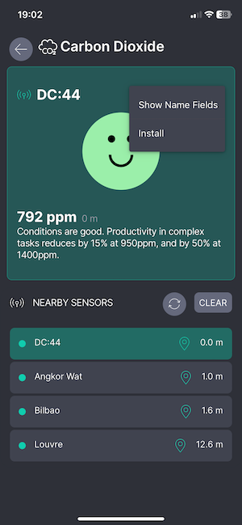
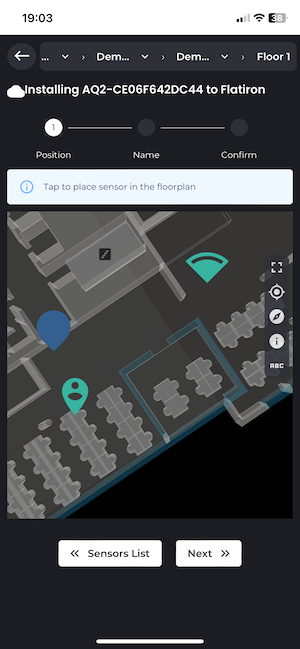
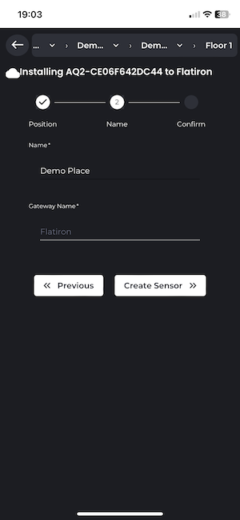

# Installation

## Installing the BASE sensor (ethernet)
### Overview
#### General
<!-- {: style="height:300px;width:300px"} -->

The BASE is a long-range, occupancy level sensor that
makes up the core of LightFi’s multi-sensor wireless IoT
infrastructure. It acts as a gateway and each BASE can support 100s
of LightFi’s IoT sensors. The BASE Pro version
includes BACnet/IP integration for all connected IoT
sensors for building automation capabilities.
This documentation describes how to install the BASE sensor and
provision it using LightFi’s [cloud portal](https://portal.lightfi.io).

#### What is included

The BASE sensor comes with a power supply (optional) and a mounting bracket.

#### Placement
The BASE sensor is designed to be ceiling mounted. We recommend that each BASE
sensor cover a 10m – 15m radius (100 - 250m²) of the floor plan when determining install locations. For open-plan areas, a coverage radius of 20m may be acceptable. For sites with many walls a
coverage radius of less than 10m may be necessary.
The range of the sensors means placement can be flexible and
adjusted to be closest to suitable cabling and mounting points.
A typical install location is similar to WiFi Access Points.

#### Power
The BASE sensor can be powered via DC power input or Power over Ethernet (PoE) 802.3af
(48V) via the PoE Port. In almost all instances, we recommend using PoE, as this will
provide data and power over a single cable and can be provided
by affordable and readily available PoE network switches.
Where PoE is not available the device can be powered using the DC power input port (it is not necessary, or desirable, to power using both PoE and DC input simultaneously).

### Cabling topology for the BASE sensors
The cabling topology for the BASE sensors will depend on available network ports
throughout the building. The BASE sensors are powered with Power over Ethernet (PoE)
802.3af, such that power and data can be handled with a single Ethernet cable.

<figure markdown>
  
  <figcaption>Example 1</figcaption>
</figure>
  <!-- {: style="height:300px;width:300px"} -->
<figure markdown>
  
  <figcaption>Example 2</figcaption>
</figure>

#### Using existing network ports
The simplest install is to utilise any available spare network ports across the building. The
BASE sensors can be plugged into existing ports (with PoE) and connected via a VLAN, or directly to a separate LAN (e.g. BMS LAN) at the comms room. If no existing network connections are available,
new cables may need to be run.

#### Running new cables
The BASE sensors can be ceiling mounted (similar to WiFi Access Points). CAT5E, CAT6 or better
network cables need to be run from the BASE sensors to a nearby network connection point,
such as a BMS panel or comms room. The network cables will provide power to the BASE
sensors, as well as a connection to the internet and BACnet/IP communication with the BMS
(where relevant).
The cabling topology will depend on the location of available connection ports. Two topology
examples are shown [above](#cabling-topology-for-the-base-sensors). In the first example a building has a single BMS panel in the
plant room, an internet connection in the comms room and network created using individual PoE switches on each floor. In the second example, there is a
BMS panel on each floor with a separate internet connection.

### Provisioning the BASE sensor
[Note: If ordering BASE sensors for a whole building it is possible to have pre-provisioned
BASE sensors, with your required IP network and BACnet settings, shipped directly from LightFi, saving
engineer time on your install. Please contact LightFi to arrange this.]

To provision the BASE sensor on LightFi’s Portal, you will need the following:

- BASE sensor powered and connected to the internet [Note: you may need to change the ip settings on the base sensor to connect to the internet i.e. change from dhcp to static ip, please follow the guide as normal, the BASE network settings are documented at step 4.]
- Ethernet cable
- Physical access to the BASE sensor
- Laptop computer with an Ethernet port and WiFi connection

#### 1 - Power sensor
Please ensure the BASE sensor is powered and connected to the internet. The LEDs
indicate the status of the BASE sensor:

- First LED on – the BASE sensor indicates power
- Second LED on – the BASE sensor is connected to the internet
- Third LED on – the BASE sensor is detecting occupancy.
Once plugged in, please allow 5 minutes for the boot sequence to finish before any
troubleshooting.

#### 2 - Setup service port connection
[Note: Before you make the changes to your network configuration on your computer, note down the existing network settings,
this will help when resetting them back afterwards.]

Please ensure your computer is connected to the internet e.g. via WiFi.
Setup your computer’s wired (Ethernet) network settings to enable connection to the BASE
sensor via its Service Port. Change the LAN configuration settings on your computer to
“manual” and use the static IP Address: 192.168.151.2 and press Apply. (Use a default Subnet
Mask of 255.255.255.0 and leave the other settings empty, as there is no internet connection
from the BASE sensor via the Service Port for security reasons). Your LAN settings are
located in:

- Apple: System Preferences > Network > {your LAN Service} > Configure IPv4 :
Manually
- Windows: Windows Settings > Network & Internet > Advanced network settings :
Change adapter options > Ethernet : Properties > Internet Protocol Version 4
(TCP/IPv4) : Properties > Use the following IP address

#### 3 - Connect to sensor

Connect an Ethernet cable from your computer to the Service Port on the BASE sensor.
Please ensure the PoE Port is also connected to the internet.

#### 4 - Launch Provisioner
Please open your web browser and enter [http://192.168.151.1](http://192.168.151.1) into the
address bar. You will be greeted by the BASE sensor’s service page, indicating that you are
now connected to the BASE sensor and the BASE sensor is itself connected
to the internet. 

If the BASE sensor greeting page says **“No Internet!”**, please check the BASE
sensor’s PoE Port is connected to the internet and refresh the web-page.
You may need to change the device network settings for your network/internet setup,
if so click the "Network Settings" button, you will require the local config password
shipped with your device (the password can be changed from the Network Settings page).

To begin provisioning your BASE sensor on LightFi’s Portal, press “Deploy Sensor”. Please
ensure your computer is connected to the internet e.g. via WiFi. You will be redirected to the
LightFi Portal, where you can login to your LightFi account and create the sensor.

#### 5 Select location
In the top left corner, select the building and floor where you want to create this BASE sensor
using the dropdown. Then press “Next”.

#### 6 Add sensor details
Give the BASE sensor a name (usually the name of the area it covers), and press “Next”. Click
on the floorplan to give the sensor a position (as close to where it is or to be located so that
others can find it later), and then press “Preview”.

#### 7 - Check details
Check you’re happy with the details you’ve entered and the location tree in which you’re
creating the sensor.

#### 8 - Confirm
Press “Confirm Details” and then “Create” to provision the sensor. Your browser may ask for
security confirmation, in which case you will need to allow the connection by pressing “Send
Anyway” (or similar).

#### 9 - Provisioning
The BASE sensor is now being provisioned. Please do not unplug the BASE sensor from the
computer (or internet) until the web page says that the setup has been completed. The BASE
sensor will then reboot. 

The sensor is now provisioned and should be visible on the LightFi portal.
(Please allow up to 5 minutes for the BASE sensor to appear on the
LightFi Portal and 10 minutes for the first data to arrive.)

## Installing Sub-sensors
### Overview

Installation of LightFi sub-sensors such as Sahara (Air Quality), Alpine (CO₂/Temperature/Humidity), Hoth (Temperature/Humidity) or X1 (PIR Motion) can be performed entirely using the LightFi portal.

To perform the configuration, you will need the following:

- The BASE sensors installed and provisioned
- Recommended:  A smartphone or similar portable device with the "LightFi Air" app from Apple/Google app store. This allows detecting nearby sensors directly from the phone and speeds up the install process.
- Alternative: Access to the LightFi portal using a web browser, such as from a laptop.
- An internet connection
- LightFi Portal account login with admin/installer privileges for the location you wish to install the sensors

### Place Sensor

Place the sensor in the room or location you want to monitor,
power the sensor as per the sensor instructions.

### Installation using LightFi Air mobile app

#### 1 - Scan and select sensor

- Launch the app and select the appropriate sensor type e.g. Temperature for a sensor with temperature data, to begin scanning for sensors.
- If you are next to the sensor to install it should appear top of the list with a strong signal.
- Select the sensor and press the 3 dots to bring up the menu for this sensor
- Select the 'Install' option from the menu as shown in the image below. (If you have not logged in on the app you may need to select the 'Admin' option first)

#### 2 - Choose sensor location and position

- The app will attempt to find the correct location based on nearby sensors, if the location shown at the top of the screen is not correct e.g. the floor level needs changing, please select the correct location.
    - Note: If you are not in the correct location or the BASE sensor cannot see the sub-sensor, then you may get a message saying "Gateway or visible sub-sensor not found", please check your selected location and BASE sensor connectivity.
- Tap on the map where the sensor is located in the building so that the pin is located in the correct position to indicate where the sensor is (the person pin is an estimate of your position and the wedge indicates the position of the BASE sensor the sub-sensor will be associated to).
- After selecting the correct position, press 'Next'

#### 3 - Name sensor

- Add the sensor name
- Ensure that the Gateway name matches a BASE in the area of the sensor
- When complete press 'Next'

#### 4 - Confirm

- After you have entered the information the sensor will be added to BASE configuration and the online portal.
- Please wait for the page to indicate that the sensor has been created and initial data has been received on the platform.
    - if you have trouble on this step please ensure that the BASE internet connection is working
- Once sensor installation is confirmed you may return to the sensors list and install more sensors
- If you need to configure BACnet details for the sensor please see [BACnet documentation](BACnet.md#example-of-wireless-sensors-bacnet-configuration)  

### Installation using web browser

#### 1 - Select Install Location

Login to your LightFi Portal account. Open the main menu
(top left) and go to the “Config” page. Using the dropdown at the top of the screen, select
the building and floor (sub locations) where the sensor is installed.

#### 2 - Find the sensor

To find the new sensor, click on the “+” in the “Configured Sensors” section. A list
of all IoT sensors near any BASE sensor on that floor (and not already configured) will appear.
To find a specific sensor you can press the Search icon and either:

- press the square Frame icon to the left of the search bar and scan the sensor’s QR
code with your camera; or
- manually type in the sensor’s id (last 4 digits is usually enough). If you are unsure about the id of the sensor, or can't find the id on the sensor, you can use the LightFi Air app to scan for the nearest sensors, the id shown in the app is the last 4 digits of the sensor id.

#### 3 - Add details

Once you've found the sensor you want to configure, press the square “+” to its
right. Please give it a name representing the room or area (so it is easy to find later). Scroll
down and give the sensor position on the floor plan (by pressing on the floor plan
in the room or area where the sensor is located). If the floor plan is not initially on
screen, click on the “Go to location” icon in the top left corner of the map.

#### 4 - Complete

To complete the setup, press “Add New Sensor”. The sensor is now configured on
the LightFi Portal, and data is being collected.

If you need to configure BACnet details for the sensor this can be done from the sensor configuration page, please see [BACnet documentation](BACnet.md#example-of-wireless-sensors-bacnet-configuration)  

