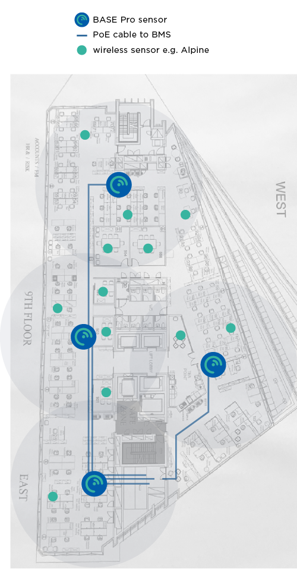
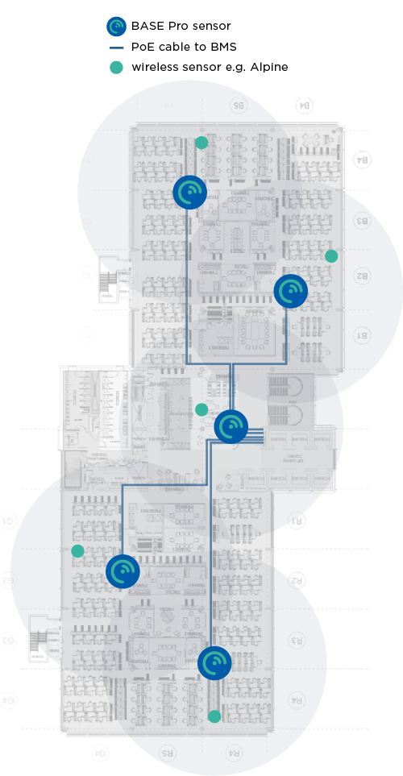
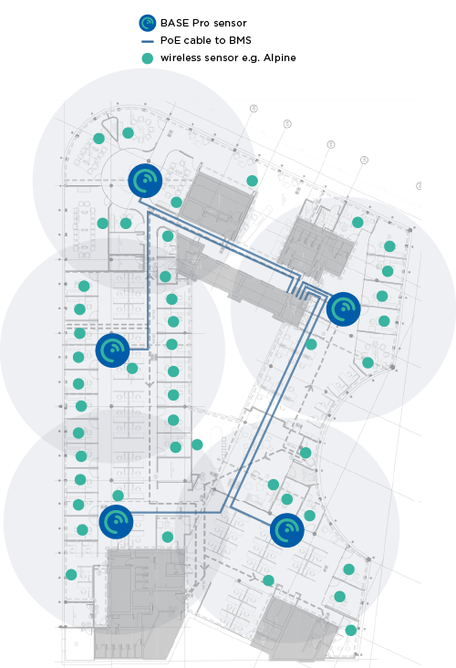

# Install Planning

## Sensor Layout

LightFi sensors split into two categories:

1. The BASE/BASE Pro device, is a 2-in-1 sensor & controller device, which has 4 functions:  
  a. receiver/transmitter for LightFi’s wireless sensors,  
  b. an occupancy level sensor,  
  c. [BASE Pro] BACnet/IP connection for itself and all wireless sensors to the BMS, and  
  d. cloud bridge to LightFi’s Portal.
2. The wireless sensors, send data to the BASE controller/sensor for granular control and monitoring.

### BASE devices

The BASE/BASE Pro devices cover a 20m – 30m diameter area for, both,
detecting occupancy levels, and receiving signals from
LightFi’s wireless sensors.

Planning full floor coverage will ensure robustness and future
adaptability. Please use the following criteria when laying out
the BASE Pro devices on a floor plan:

  - For open plan areas, one BASE Pro is sufficient every 30 meters (15m radius)
  - For areas with meeting rooms, one BASE Pro is sufficient every 20 meters (10m radius)
  - Lift shafts, core staircases and other supporting walls can be barriers for wireless signals, it is safest to treat them as impermeable.
  - For large enclosed spaces, such as auditoriums, airport gate rooms, lecture theatres, etc., one BASE Pro is sufficient.

The annotated floor plans below give an example of the number of BASE Pro sensors needed
for full coverage of an office floor (with Ethernet cable runs). The BASE Pro is ceiling mounted,
and its long detection range allows for flexible placement to utilise existing cabling routes.

### Wireless sensors

The line-of-sight communication capability of the wireless sensors is up
to 100m, however, for robustness and continuity please keep wireless
sensors within 20m or less of a BASE Pro.

These sensors are battery powered (typically 5-years), and measure:

  - Alpine – CO₂, temperature & relative humidity
  - X1 – PIR motion, 120-degree view & up to 7m range, ceiling or wall mounted.
  - Hall – window/door open/close contact

These sensors need local 12-24V DC power, and measure:

  - Sahara – CO₂, PM1, PM2.5, PM10, TVOC, NOX, temperature & relative humidity, usually for WELL standard certification
  - Radar – people counting for meeting rooms, ceiling mounted with 120-degree view, typically 6m diameter coverage.

We recommend issuing at least one Alpine sensor per BASE Pro for open plan areas, and as
needed for meeting rooms and/or other clients’ needs. Some of the bigger rooms (board
rooms, etc) may benefit from more than one CO₂ sensor.

The annotated floor plans below give an example of sensor deployments.

<figure markdown>
  
  <figcaption>Example 1</figcaption>
</figure>
<figure markdown>
  
  <figcaption>Example 2</figcaption>
</figure>
<figure markdown>
  
  <figcaption>Example 3</figcaption>
</figure>

## Cabling topology for the BASE sensors

The cabling topology for the BASE sensors will depend on available network ports
throughout the building. The BASE sensors are powered with Power over Ethernet (PoE)
802.3af, such that power and data can be handled with a single Ethernet cable.

<figure markdown>
  
  <figcaption>Example 1</figcaption>
</figure>
  <!-- {: style="height:300px;width:300px"} -->
<figure markdown>
  
  <figcaption>Example 2</figcaption>
</figure>

### Using existing network ports

The simplest install is to utilise any available spare network ports across the building. The
BASE sensors can be plugged into existing ports (with PoE) and connected via a VLAN, or directly to a separate LAN (e.g. BMS LAN) at the comms room. If no existing network connections are available,
new cables may need to be run.

### Running new cables

The BASE sensors can be ceiling mounted (similar to WiFi Access Points). CAT5E, CAT6 or better
network cables need to be run from the BASE sensors to a nearby network connection point,
such as a BMS panel or comms room. The network cables will provide power to the BASE
sensors, as well as a connection to the internet and BACnet/IP communication with the BMS
(where relevant).
The cabling topology will depend on the location of available connection ports. Two topology
examples are shown [above](#cabling-topology-for-the-base-sensors). In the first example a building has a single BMS panel in the
plant room, an internet connection in the comms room and network created using individual PoE switches on each floor. In the second example, there is a
BMS panel on each floor with a separate internet connection.

