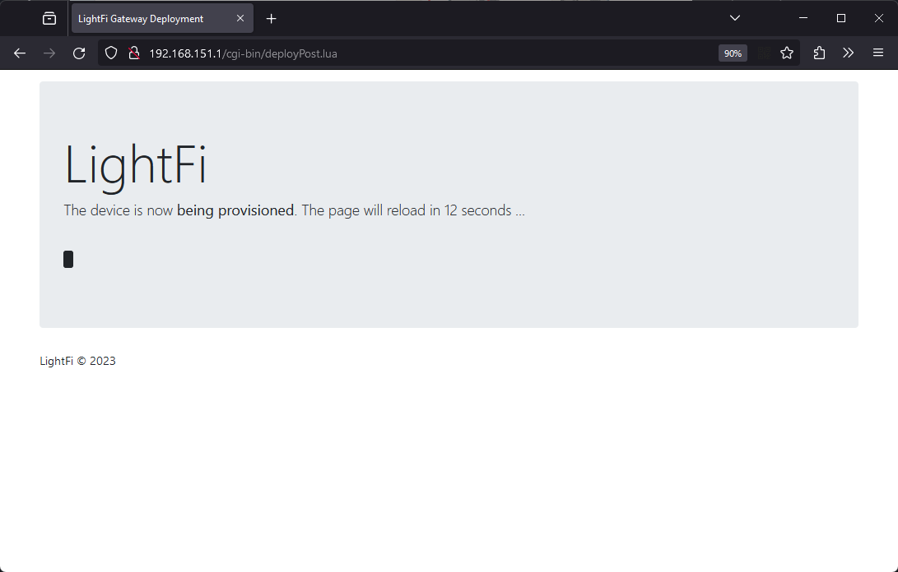

# Installing BASE sensors

## Overview
### General
<!-- {: style="height:300px;width:300px"} -->

The BASE is a long-range, occupancy level sensor that
makes up the core of LightFi’s multi-sensor wireless IoT
infrastructure. It acts as a gateway and each BASE can support 100s
of LightFi’s IoT sensors. The BASE Pro version
includes BACnet/IP integration for all connected IoT
sensors for building automation capabilities.
This documentation describes how to install the BASE sensor and
provision it using LightFi’s [cloud portal](https://portal.lightfi.io).

### What is included

The BASE sensor comes with a power supply (optional) and a mounting bracket.

### Placement
For a detailed description see [Install Planning](01_install_planning.md#sensor-layout).

The BASE sensor is designed to be ceiling mounted. We recommend that each BASE
sensor cover a 10m – 15m radius (100 - 250m²) of the floor plan when determining install locations. For open-plan areas, a coverage radius of 20m may be acceptable. For sites with many walls a
coverage radius of less than 10m may be necessary.
The range of the sensors means placement can be flexible and
adjusted to be closest to suitable cabling and mounting points.
A typical install location is similar to WiFi Access Points.

### Power
The BASE sensor can be powered via DC power input or Power over Ethernet (PoE) 802.3af
(48V) via the PoE Port. In almost all instances, we recommend using PoE, as this will
provide data and power over a single cable and can be provided
by affordable and readily available PoE network switches.
Where PoE is not available the device can be powered using the DC power input port (it is not necessary, or desirable, to power using both PoE and DC input simultaneously).

## Provisioning the BASE sensor
[Note: If ordering BASE sensors for a whole building it is possible to have pre-provisioned
BASE sensors, with your required IP network and BACnet settings, shipped directly from LightFi, saving
engineer time on your install. Please contact LightFi to arrange this.]

To provision the BASE sensor on LightFi’s Portal, you will need the following:

- BASE sensor powered and connected to the internet [Note: you may need to change the ip settings on the base sensor to connect to the internet i.e. change from dhcp to static ip, please follow the guide as normal, the BASE network settings are documented at step 4.]
- Ethernet cable
- Physical access to the BASE sensor
- Laptop computer with an Ethernet port and WiFi connection

### 1 - Power sensor
Please ensure the BASE sensor is powered and connected to the internet. The LEDs
indicate the status of the BASE sensor:

- First LED on – the BASE sensor indicates power
- Second LED on – the BASE sensor is connected to the internet
- Third LED on – the BASE sensor is detecting occupancy.
Once plugged in, please allow 5 minutes for the boot sequence to finish before any
troubleshooting.

### 2 - Setup service port connection
[Note: Before you make the changes to your network configuration on your computer, note down the existing network settings,
this will help when resetting them back afterwards.]

Please ensure your computer is connected to the internet e.g. via WiFi.
Setup your computer’s wired (Ethernet) network settings to enable connection to the BASE
sensor via its Service Port. Change the LAN configuration settings on your computer to
“manual” and use the static IP Address: 192.168.151.2 and press Apply. (Use a default Subnet
Mask of 255.255.255.0 and leave the other settings empty, as there is no internet connection
from the BASE sensor via the Service Port for security reasons). Your LAN settings are
located in:

- Apple: System Preferences > Network > {your LAN Service} > Configure IPv4 :
Manually
- Windows: Windows Settings > Network & Internet > Advanced network settings :
Change adapter options > Ethernet : Properties > Internet Protocol Version 4
(TCP/IPv4) : Properties > Use the following IP address

### 3 - Connect to sensor

Connect an Ethernet cable from your computer to the Service Port on the BASE sensor.
Please ensure the PoE Port is also connected to the internet.

### 4 - Launch Provisioner
Please open your web browser and enter [http://192.168.151.1](http://192.168.151.1) into the
address bar. You will be greeted by the BASE sensor’s service page, indicating that you are
now connected to the BASE sensor and the BASE sensor is itself connected
to the internet. 

If the BASE sensor greeting page says **“No Internet!”**, please check the BASE
sensor’s PoE Port is connected to the internet and refresh the web-page.
You may need to change the device network settings for your network/internet setup,
if so click the "Network Settings" button, you will require the local config password
shipped with your device (the password can be changed from the Network Settings page).

To begin provisioning your BASE sensor on LightFi’s Portal, press “Deploy Sensor”. Please
ensure your computer is connected to the internet e.g. via WiFi. You will be redirected to the
LightFi Portal, where you can login to your LightFi account and create the sensor.

### 5 - Select location
In the top left corner, select the building and floor where you want to create this BASE sensor
using the dropdown. Then press “Next”.

### 6 - Add sensor details
Give the BASE sensor a name (usually the name of the area it covers), and press “Next”. Click
on the floorplan to give the sensor a position (as close to where it is or to be located so that
others can find it later), and then press “Preview”.

### 7 - Check details
Check you’re happy with the details you’ve entered and the location tree in which you’re
creating the sensor.

### 8 - Confirm
Press “Confirm Details” and then “Create” to provision the sensor. Your browser may ask for
security confirmation, in which case you will need to allow the connection by pressing “Send
Anyway” (or similar).

### 9 - Provisioning
The BASE sensor is now being provisioned. Please do not unplug the BASE sensor from the
computer (or internet) until the web page says that the setup has been completed. The BASE
sensor will then reboot. 

The sensor is now provisioned and should be visible on the LightFi portal.
(Please allow up to 5 minutes for the BASE sensor to appear on the
LightFi Portal and 10 minutes for the first data to arrive.)

