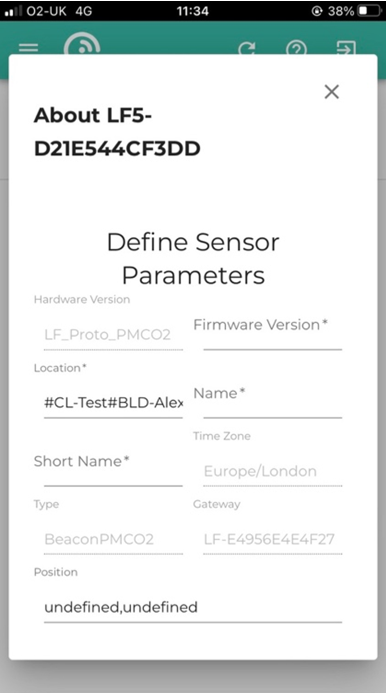
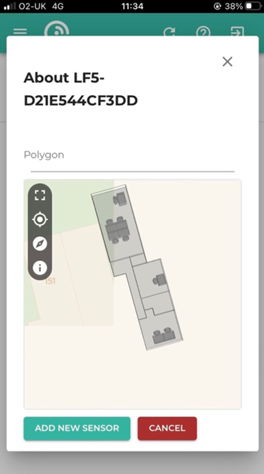

# Installing Wireless Sub-sensors
## Overview

Installation of LightFi sub-sensors such as Sahara (Air Quality), Alpine (CO₂/Temperature/Humidity), Hoth (Temperature/Humidity) or X1 (PIR Motion) can be performed entirely using the LightFi portal.

To perform the configuration, you will need the following:

- The BASE sensors installed and provisioned
- Recommended:  A smartphone or similar portable device with the "LightFi Air" app from Apple/Google app store. This allows detecting nearby sensors directly from the phone and speeds up the install process.
- Alternative: Access to the LightFi portal using a web browser, such as from a laptop.
- An internet connection
- LightFi Portal account login with admin/installer privileges for the location you wish to install the sensors

## Place Sensor

To simplify the installation process keep the sub-sensors unpowered until they are in position. Place the sensor in the room or location you want to monitor,
one-by-one power the sensor as per the sensor instructions and
install it using the following instructions.

## Installation using LightFi Air mobile app

### 1 - Scan and select sensor

- Launch the app and select the appropriate sensor type e.g. Temperature for a sensor with temperature data, to begin scanning for sensors.
- If you are next to the sensor to install it should appear top of the list with a strong signal.
- Select the sensor and press the 3 dots to bring up the menu for this sensor
- Select the 'Install' option from the menu as shown in the image below. (If you have not logged in on the app you may need to select the 'Admin' option first)

### 2 - Choose sensor location and position

- The app will attempt to find the correct location based on nearby sensors, if the location shown at the top of the screen is not correct e.g. the floor level needs changing, please select the correct location.
    - Note: If you are not in the correct location or the BASE sensor cannot see the sub-sensor, then you may get a message saying "Gateway or visible sub-sensor not found", please check your selected location and BASE sensor connectivity.
- Tap on the map where the sensor is located in the building so that the pin is located in the correct position to indicate where the sensor is (the person pin is an estimate of your position and the wedge indicates the position of the BASE sensor the sub-sensor will be associated to).
- After selecting the correct position, press 'Next'

### 3 - Name sensor

- Add the sensor name
- Ensure that the Gateway name matches a BASE in the area of the sensor
- When complete press 'Next'

### 4 - Confirm

- After you have entered the information the sensor will be added to BASE configuration and the online portal.
- Please wait for the page to indicate that the sensor has been created and initial data has been received on the platform.
    - if you have trouble on this step please ensure that the BASE internet connection is working
- Once sensor installation is confirmed you may return to the sensors list and install more sensors
- If you need to configure BACnet details for the sensor please see [BACnet documentation](BACnet.md#example-of-wireless-sensors-bacnet-configuration)  

## Installation using web browser

### 1 - Select Install Location

Login to your LightFi Portal account. Open the main menu
(top left) and go to the “Config” page. Using the dropdown at the top of the screen, select
the building and floor (sub locations) where the sensor is installed.

### 2 - Find the sensor

To find the new sensor, click on the “+” in the “Configured Sensors” section. A list
of all IoT sensors near any BASE sensor on that floor (and not already configured) will appear.
To find a specific sensor you can press the Search icon and either:

- press the square Frame icon to the left of the search bar and scan the sensor’s QR
code with your camera; or
- manually type in the sensor’s id (last 4 digits is usually enough). If you are unsure about the id of the sensor, or can't find the id on the sensor, you can use the LightFi Air app to scan for the nearest sensors, the id shown in the app is the last 4 digits of the sensor id.

### 3 - Add details

Once you've found the sensor you want to configure, press the square “+” to its
right. Please give it a name representing the room or area (so it is easy to find later). Scroll
down and give the sensor position on the floor plan (by pressing on the floor plan
in the room or area where the sensor is located). If the floor plan is not initially on
screen, click on the “Go to location” icon in the top left corner of the map.

### 4 - Complete

To complete the setup, press “Add New Sensor”. The sensor is now configured on
the LightFi Portal, and data is being collected.

If you need to configure BACnet details for the sensor this can be done from the sensor configuration page, please see [BACnet documentation](BACnet.md#example-of-wireless-sensors-bacnet-configuration)  

