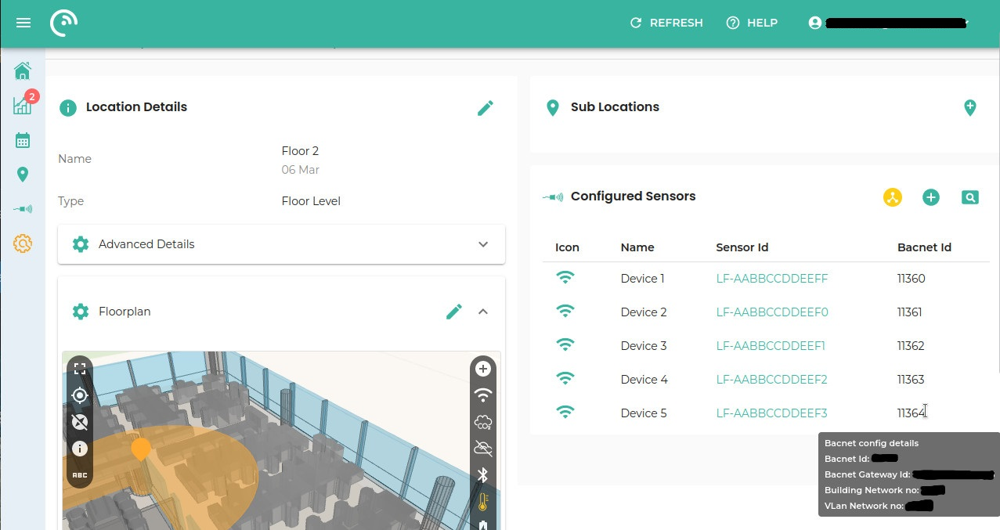

# BACnet

LightFi sensors can be used to monitor multiple types of physical spaces (such as offices, airports, universities, ...).

These sensors are able to measure different types of data and report this data directly to the building management system (BMS):

- [Base](#lightfi-base) - Broad Level Occupancy Sensor.
- [Hoth](#lightfi-hoth) - Temperature and Humidity;
- [Sahara](#lightfi-sahara) - CO₂ and Particulate Matter;
- [X1](#lightfi-x1) - Presence;

The [Base](#lightfi-base) sensor includes wireless technology capabilities that allow it to act as a gateway for receiving data from the other sensors and send it to the LightFi cloud [platform](http://portal.lightfi.io) for data visualisation. The Base sensor also acts as a gateway for the BACnet/IP implementation, enabling the Base to create BACnet representations of the actual wireless sensors.

The sensor data from all sensors can then be used by the BMS to monitor and directly control the building, for example using occupancy to alter the ventilation dynamically according to the building usage, keeping the air quality high and the energy use low.

<figure markdown>
  
  <figcaption>Example BACnet implementation of LightFi sensors on a BMS network</figcaption>
</figure>

## LightFi BACnet Sensors

### LightFi Base

The LightFi "Base" sensor is a long-range, broad level occupancy sensor, which determines the percentage occupancy levels by measuring the number active devices on a floor area, with coverage of 250 - 500+ m².

| Object Type   | Object ID | Object Name                     | Present Value                |
|---------------|-----------|---------------------------------|------------------------------|
| Device        | (1)       | LightFi_LF-AABBCCDDEEFF         | N/A                          |
| Analog Input  | AI1       | WiFi Occupancy Raw (number)     | Current value / Default = 0|
| Analog Input  | AI2       | WiFi Occupancy Percentage       | (AI 1) / (AV 1) * 100        |
| Analog Value  | AV1       | WiFi Occupancy Maxium Setpoint  | Default = 100                |

Notes:

1. Object ID can be configured via LightFi Portal;

2. The Object Name field will depend on the device’s MAC Address. This value should start with "LightFi_LF-".

3. The PICS document for this sensor can be found here: [LightFi Base](https://nextcloud.lightfi.io/index.php/s/CNNrDCBdWopbjF5)

### LightFi Sahara

The Sahara sensor measures: Carbon Dioxide (CO2) levels with a dual-channel NDIR sensor and Particulate Matter (PM2.5).

| Object Type   | Object ID | Object Name                     | Present Value                |
|---------------|-----------|---------------------------------|------------------------------|
| Device        | (1)       | LightFi_LF5-AABBCCDDEEFF (2)    | N/A                          |
| Analog Input  | AI1       | Carbon Dioxide level (ppm)      | Current Reading / -999 if not initialised |
| Analog Input  | AI2       | Particulate Matter PM2.5        | Current Reading / -1 if not initialised   |
| Analog Input  | AI3       | RSSI                            | Current Reading / -999 if not initialised |

Notes:

1. Object ID can be configured via LightFi Portal;

2. The Object Name field will depend on the device’s MAC Address. This value should start with "LightFi_LF5-".

3. The PICS document for this sensor can be found here: [LightFi Sahara](https://nextcloud.lightfi.io/index.php/s/f7kEC7t4rrD3pKo)

### LightFi Hoth

The Hoth sensor measures temperature, relative humidity and its own battery level.

| Object Type   | Object ID | Object Name                          | Present Value                               |
|---------------|-----------|--------------------------------------|---------------------------------------------|
| Device        | (1)       | LightFi_MS1-AABBCCDDEEFF (2)         | N/A                                         |
| Analog Input  | AI1       | Temperature value (Celsius)          | Current Reading / -1 if not initialised     |
| Analog Input  | AI2       | Relative Humidity value (Percentage) | Current Reading / -1 if not initialised     |
| Analog Input  | AI3       | RSSI                                 | Current Reading / -999 if not initialised   |
| Analog Input  | AI4       | Battery Level Value (Percentage)     | Current Reading / -999 if not initialised   |

Notes:

1. Object ID can be configured via LightFi Portal;

2. The Object Name field will depend on the device’s MAC Address. This value should start with "LightFi_MS1-".

3. The PICS document for this sensor can be found here: [LightFi Hoth](https://nextcloud.lightfi.io/index.php/s/KnX3yiCKiKy5aCq)

### LightFi X1

The X1 is a battery powered Passive Infrared (PIR) motion sensor, designed to detect binary desk or room occupancy.

| Object Type   | Object ID | Object Name                      | Present Value                |
|---------------|-----------|----------------------------------|------------------------------|
| Device        | (1)       | LightFi_AMP-AABBCCDDEEFF (2)     | N/A                          |
| Analog Input  | AI1       | Motion Sensor (Presence)         | Current Reading / -1 if not initialised   |
| Analog Input  | AI3       | RSSI                             | Current Reading / -999 if not initialised |
| Analog Input  | AI4       | Battery Level Value (Percentage) | Current Reading / -999 if not initialised |

Notes:

1. Object ID can be configured via LightFi Portal;

2. The Object Name field will depend on the device’s MAC Address. This value should start with "LightFi_AMP-". 

3. The PICS document for this sensor can be found here: [LightFi X1](https://nextcloud.lightfi.io/index.php/s/EqpYZK8X6syFMtx)

## Enabling Sensors in BACnet Network

### Base Sensor

Activation of the Base Sensor can be made through the LightFi Portal by accessing "BACnet Config" in the desired base sensor configuration page and pressing the "Enable" button.

When activating the Base Sensor in our platform, the following fields are able to be configured:

- Building Network Number - The network number of the existing building BACnet/IP network the sensor will be connected to e.g. 2000 (For BACnet/IP this number may not affect your implementation, if you do not know the number it may be possible to use a default like 2000);
- VLAN Network Number - This should not clash with any other BACnet network numbers;
- BACnet ID of the device - A unique ID for the sensor according to your BACnet/IP configuration.

After entering these fields, the device will take around 2 minutes to apply the changes and create the BACnet gateway.

#### Example of Base Sensor BACnet configuration

1. Using the LightFi Portal dashboard, select a sensor and go to the sensor configuration page by clicking on "Info":

2. On the Sensor Configuration page, click on "BACnet Config" section and then press "Enable":

3. Press on the "Enable" button, fill the fields and then press "Submit":

4. When you press submit, a small blue circle will indicate the sensor is BACnet enabled (`1.`) and a Success/confirmation message (`2.`) will appear.

### Wireless Sensors

All the other available wireless sensors can be activated in the same way, by accessing  "BACnet Config" in the desired wireless sensor configuration page and pressing the "Enable" button.

This will make a text field appear for entering its BACnet ID. Note that if a BACnet ID is not entered, our system will pick one and present it in the configuration page.

Unlike the Base sensor, these changes will apply immediately and the sensors should be available on the BACnet/IP Network within a few seconds.

#### Example of Wireless Sensors BACnet configuration

A wireless sensor can only be BACnet enabled if it was previously registered on the portal (See [here](../01_install)).

1. Using the dashboard, select a wireless sensor and go to the sensor configuration page by clicking on "Info":

2. On the Sensor Configuration page, click on "BACnet Config" section and then press "Enable":

3. Fill the fields and then press "Submit":

4. When you press submit, a small blue circle will indicate the sensor is BACnet enabled (`1.`) and a Success/confirmation message (`2.`) will appear.

## Viewing Sensors in BACnet Network

All active LightFi sensors in a BACnet network can be viewed on the Configuration Page.

After selecting the desired Location ("Sub Location" section), press the "Show BACnet Enabled Sensors" button on the "Configured Sensors" section (see image).

For detailed BACnet information on a specific device, hover the mouse on the desired BACnet ID item and a tooltip will appear.

