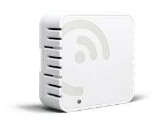

# Sensor Overview

LightFi produce a range of sensors for gathering building data and facilitation of building control via integration with the Building Management System (BMS)

## LightFi BASE / BASE Pro

<!-- {: style="height:300px;width:300px"} -->

The LightFi "BASE" sensor is a long-range, broad level occupancy sensor, which determines the occupancy levels by measuring the number active devices on a floor area, with coverage of 250 – 1000 square meters depending on placement and number of walls etc. (the sensors can function through walls but the range is reduced).

The BASE sensor also functions as a router/gateway for LightFi sensors, reporting data to the cloud and allowing configuration of sensor settings and sub-sensors via the portal or API interface.
Each base can support 100s of wireless sub-sensors.

If [BACnet](BACnet.md) enabled [BASE Pro only], this sensor will also function as a BACnet/IP router device, with it’s own BACnet network number (configurable via LightFi Portal). This will allow the BASE sensor itself and all configured sub-sensors to be accessible via BACnet/IP ([BACnet object description](BACnet.md/#lightfi-base)).

### What is included

The BASE sensor comes with a power supply (optional) and a mounting bracket.

### Placement
For a detailed description of where sensors should be located within the building
see [Install Planning](01_install_planning.md#sensor-layout).

The BASE sensor is designed to be ceiling mounted.
The range of the sensors means placement can be flexible and
adjusted to be closest to suitable cabling and mounting points.
A typical install location is similar to WiFi Access Points.

### Power
The BASE sensor can be powered via DC power input or Power over Ethernet (PoE) 802.3af
(48V) via the PoE Port. In almost all instances, we recommend using PoE, as this will
provide data and power over a single cable and can be provided
by affordable and readily available PoE network switches.
Where PoE is not available the device can be powered using the DC power input port (it is not necessary, or desirable, to power using both PoE and DC input simultaneously).

## LightFi Alpine

The Alpine is a battery powered sensor that measures: Carbon Dioxide (CO₂) levels with a dual-channel NDIR sensor, Temperature and Relative Humidity.

The sensor requires a configuration with a LightFi BASE Sensor in order to be visible on the BACnet network.

### Power-on

Using the button that is inside the sensor box, next to the battery holder. Please take off the front plate to access.

  - ON: press-and-hold the button, LED will long-blink once
  - OFF: press-and-hold the button, LED will blink twice

If BACnet enabled, this sensor will appear as a BACnet/IP device on the BACnet network created by the BACnet router internal to the BASE Sensor ([BACnet object description](BACnet.md/#lightfi-alpine)).

## LightFi Sahara

The Sahara sensor measures: Carbon Dioxide (CO₂) levels with a dual-channel NDIR sensor and Particulate Matter (PM2.5).

The sensor requires a configuration with a LightFi BASE Sensor in order to be visible on the BACnet network.

If BACnet enabled, this sensor will appear as a BACnet/IP device on the BACnet network created by the BACnet router internal to the BASE Sensor ([BACnet object description](BACnet.md/#lightfi-sahara)).

## LightFi Hoth

The Hoth sensor measures temperature, relative humidity and its own battery level.

The sensor requires a configuration with a LightFi BASE sensor in order to be visible on the BACnet network.

If BACnet enabled, this sensor will appear as a BACnet/IP device on the BACnet network created by the BACnet router internal to the BASE sensor ([BACnet object description](BACnet.md/#lightfi-hoth)).

## LightFi X1

The X1 is a battery powered Passive Infrared (PIR) motion sensor, designed to detect binary desk or room occupancy. 

The sensor requires a configuration with a LightFi BASE sensor in order to be visible on the BACnet network.

If BACnet enabled, this sensor will appear as a BACnet/IP device on the BACnet network created by the BACnet router internal to the BASE sensor ([BACnet object description](BACnet.md/#lightfi-x1)).

### Power

Pressing on the front face of the sensor will activate the button - you will hear a click.
Use this button to turn the sensor:

  - ON: press the front face once, blue LED will blink once
  - OFF: double press the front face, blue LED will blink twice

## Install guide

See [Installation](./01_install_planning.md)

For more information on BACnet objects for these devices, check the [BACnet section](./BACnet.md).
